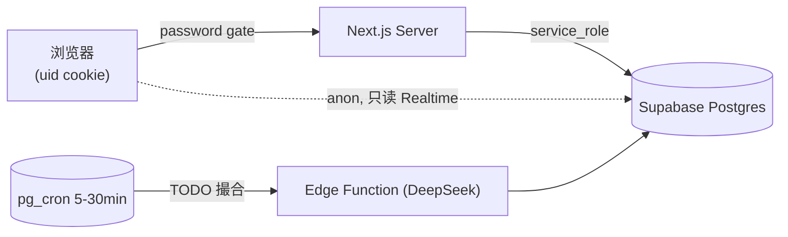
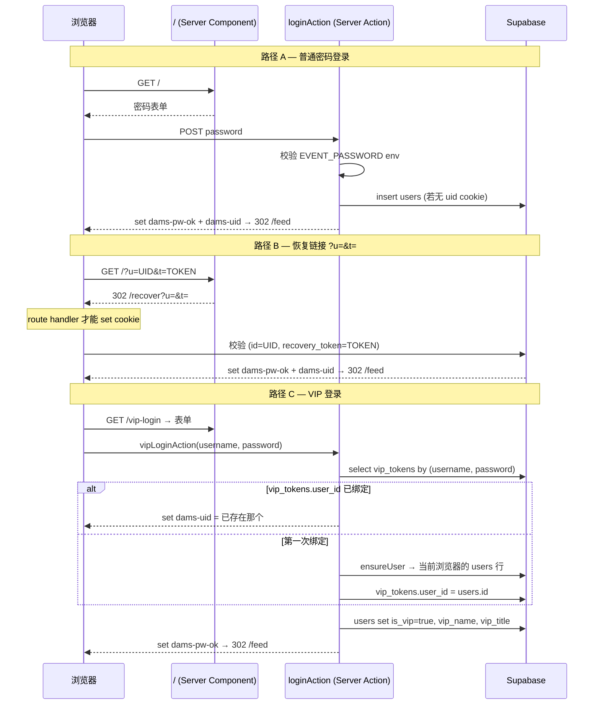

# 系统架构

> 配套读物：`CLAUDE.md`（项目快照）、`schema.md`（DB 字段）、`matching-design.md`（撮合设计）

---

## 1. 总览



**3 类参与者**
- **Browser**：每个浏览器一条 `users` 行（UUID）。无 Supabase Auth。
- **Next.js Server**：所有写操作走这里，用 service_role key 直连 Supabase（绕过 RLS）。
- **Supabase**：Postgres + Realtime + 未来的 Edge Function。

**两把 key 的分工**
| Key | 用途 | 在哪用 |
|---|---|---|
| `SUPABASE_SERVICE_ROLE_KEY` | 写 + 任意读 | 仅 Server（actions/queries/route handlers） |
| `NEXT_PUBLIC_SUPABASE_ANON_KEY` | 只读（受 RLS 限制） | Client（Realtime 订阅，未接） |

---

## 2. 身份系统（最复杂部分）

我们没有 Supabase Auth。身份建立在两个 cookie 上：

| Cookie | 含义 | 设值时机 |
|---|---|---|
| `dams-pw-ok` | 通过了活动密码 | 密码正确 / 恢复链接命中 / VIP 登录 |
| `dams-uid` | 浏览器对应的 users.id | 首次发帖前自动 ensureUser / 恢复 / VIP 登录 |

两个 cookie 都过期时间 = `EVENT_END + 7 天`（见 `constants.ts`）。

### 2.1 三种进入方式



### 2.2 关键不变量

- **1 浏览器 ↔ 1 users 行**（普通用户）
- **1 VIP token ↔ 1 users 行**（跨设备共享 — 不同设备登 VIP 后 uid cookie 都指向同一行）
- **密码 cookie 仅证明"通过门"**，与具体用户身份解耦
- **uid cookie 丢失但 recovery_token 还在** → 用恢复链接 7 天内可换回

### 2.3 为什么恢复要走 `/recover` route handler

Server Components **不能 `cookies().set()`**（Next.js 限制）。恢复链接 `/?u=&t=` 命中 root page（Server Component），所以它只能 redirect 到 route handler `/recover`，那里才能 set cookies。详见 `src/app/recover/route.ts`。

---

## 3. 密码门（proxy.ts）

```ts
// src/proxy.ts (注意：v16 改名 middleware → proxy)
PUBLIC_EXACT = ['/', '/recover', '/vip-login']
```

- 公开路径直接放行
- 其他路径检查 `dams-pw-ok` cookie，没有 → 重定向到 `/?next=<path>`
- 静态资源 / `_next/*` / `.svg` 在 matcher 里排除

---

## 4. 写入路径（Server Actions）

**所有写操作必须走 Server Action 或 Route Handler**，绝不在 client 直连 Supabase 写。

| 文件 | 主要 export | 触发场景 |
|---|---|---|
| `actions/posts.ts` | `createPostAction` | PostComposer 提交 |
| `actions/replies.ts` | `createReplyAction` | ReplySection 提交 |
| `actions/likes.ts` | `toggleLikeAction` | LikeButton 点击 |
| `actions/profile.ts` | `updateProfileAction` | /me 的 ProfileForm |
| `actions/vip.ts` | `vipLoginAction` | /vip-login 表单 |
| `actions/polls.ts` | `createPollAction`, `voteAction` | PollComposer / PollCard |
| `actions/screen.ts` | `fetchScreenData` | /screen 10s polling |

通用模式：`getServerSupabase()` → CRUD → `revalidatePath('/feed')` 或 `redirect()`。

---

## 5. 读取路径（Queries）

| 文件 | 主要 export | 用途 |
|---|---|---|
| `queries/posts.ts` | `fetchFeed(authorId?)` | 时间线 + author + replies + like_count + poll_votes 一次 join |
| `queries/me.ts` | `fetchMyData()` | /me 的"我的帖子 + 收到的回复" |

也走 service role（绕过 RLS），保持 server-only。

---

## 6. 实时（Realtime）

**当前未接入**。`/screen` 用 10s 轮询替代（见 `src/components/screen/ScreenView.tsx`），`/feed` 暂无自动刷新。

接入计划见 CLAUDE.md task #3：用 `@supabase/supabase-js` 的 anon client 在浏览器端订阅 `posts/replies/likes/poll_votes` 的 INSERT 事件。

---

## 7. /screen 投影模式

4 时钟 state machine（详见 `src/components/screen/ScreenView.tsx`）：

| 时钟 | 周期 | 作用 |
|---|---|---|
| UI tick | 1s | 时间显示、过渡动画 |
| Timeline focus | 8s | 焦点帖子轮播（1 大 + 4 小） |
| Slot | 30s | 决定当前 slot 是 timeline 还是某个 active poll |
| Server poll | 10s | 拉新数据（新帖 / 投票） |

布局：max-width 1400px，焦点居中（避免宽屏被拉散）。底部 QR 码 + 在线人数（基于 `users.last_seen_at` 5min 窗口，仅 `/feed` 访问会更新）。

---

## 8. 模块职责索引

```
src/
  proxy.ts              密码门
  app/
    page.tsx            密码登录入口（含恢复链接转发）
    recover/route.ts    恢复 cookie 落地（route handler 才能 set cookie）
    vip-login/page.tsx  VIP 表单
    feed/page.tsx       时间线（默认入口）
    me/page.tsx         /me tab
    matches/page.tsx    占位（按 F'' 决策即将废除）
    screen/page.tsx     投影模式
    layout.tsx          根 layout + Header
  components/           UI（PostCard, Composer 等）
  lib/
    identity.ts         cookie + UUID 核心
    constants.ts        事件配置 + cookie 过期
    types.ts            DB 行类型
    supabase/
      server.ts         service-role client (server-only)
      client.ts         anon client (用于 Realtime, 未接)
    actions/            写操作 (Server Actions)
    queries/            读操作
supabase/
  migrations/           SQL schema
```
