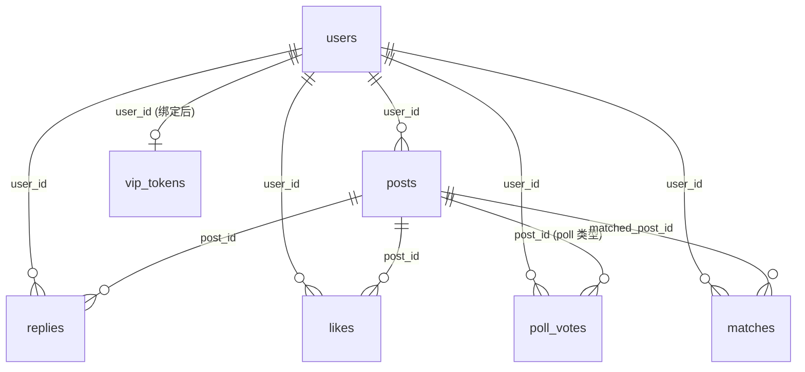

# 数据库 Schema

> 来源：`supabase/migrations/0001_schema.sql`、`0002_realtime.sql`、`0003_vip_login.sql`
>
> 即将变更：F'' 撮合方案落地后会有 `0004_match_intent.sql`（详见 `matching-design.md` §6）

---

## 1. 表关系图



---

## 2. 表清单

### users — 浏览器身份
不是 Supabase Auth 的 user，是浏览器对应的 record。

| 字段 | 类型 | 说明 |
|---|---|---|
| `id` | uuid PK | `gen_random_uuid()`，存到浏览器 cookie |
| `nickname` | text? | 自填昵称；null = 显示"匿名" |
| `company` | text? | 公司 |
| `contact_handle` | text? | LinkedIn / 邮箱 / 微信 |
| `show_contact` | bool | 是否在帖子下展示联系方式 |
| `recovery_token` | text unique | `gen_random_bytes(16) hex`，用于跨设备恢复 |
| `is_vip` | bool | VIP 登录后置 true |
| `vip_name` | text? | VIP 实名（覆盖 nickname） |
| `vip_title` | text? | VIP 职位 |
| `created_at` | timestamptz | |
| `last_seen_at` | timestamptz | `/feed` 访问时更新；用于 `/screen` 在线人数 |

### posts — 单一时间线（text + poll）

| 字段 | 类型 | 说明 |
|---|---|---|
| `id` | bigserial PK | |
| `user_id` | uuid FK→users | 作者 |
| `type` | text | `'text'` 或 `'poll'` |
| `body` | text ≤300 | 帖子正文 |
| `tags` | text[] | 自由文本 tags |
| `show_contact` | bool | 单帖维度的展示开关（覆盖 users.show_contact） |
| `poll_options` | jsonb? | `[{id, label}]`，仅 poll 类型 |
| `poll_multi` | bool? | 多选 |
| `poll_deadline` | timestamptz? | 截止时间（当前硬编码 = EVENT_END） |
| `poll_hide_results` | bool? | 投票前隐藏结果 |
| `created_at` | timestamptz | |

索引：`created_at desc`、`tags GIN`

### replies — 帖子下的扁平回复
（即将变更：F'' 加 `is_ai`、`visibility`、`mentioned_user_id`）

| 字段 | 类型 |
|---|---|
| `id` | bigserial PK |
| `post_id` | bigint FK→posts |
| `user_id` | uuid FK→users |
| `body` | text ≤300 |
| `created_at` | timestamptz |

索引：`(post_id, created_at)`

### likes — 复合主键

| 字段 | 类型 |
|---|---|
| `user_id` | uuid FK→users |
| `post_id` | bigint FK→posts |
| `created_at` | timestamptz |
| PK | `(user_id, post_id)` |

### poll_votes — 复合主键（支持多选）

| 字段 | 类型 |
|---|---|
| `user_id` | uuid FK→users |
| `post_id` | bigint FK→posts |
| `option_id` | int |
| `created_at` | timestamptz |
| PK | `(user_id, post_id, option_id)` |

多选时同 (user, post) 多行；单选时只有一行（重投票先 delete 再 insert）。

### vip_tokens — 主办方预录入

| 字段 | 类型 | 说明 |
|---|---|---|
| `token` | text PK | 自动生成（hex），不再用做登录方式（保留兼容） |
| `username` | text unique | VIP 登录用户名（0003 加） |
| `password` | text | VIP 登录密码（0003 加，明文存储 — 单场活动可接受） |
| `vip_name` | text | 实名 |
| `vip_title` | text? | 职位 |
| `user_id` | uuid? FK→users | 第一次登录时绑定 |
| `created_at` | timestamptz | |
| `used_at` | timestamptz? | 第一次绑定时间 |

### matches — AI 撮合结果
**即将废除**（F'' 决策 — 撮合结果改存到 replies）

| 字段 | 类型 |
|---|---|
| `id` | bigserial PK |
| `user_id` | uuid FK→users |
| `matched_post_id` | bigint FK→posts |
| `score` | real |
| `reason` | text |
| `computed_at` | timestamptz |
| 唯一 | `(user_id, matched_post_id)` |

---

## 3. RLS 策略

所有表 `enable row level security`。

| 角色 | 能力 |
|---|---|
| `service_role` | 完全绕过 RLS（Server 用） |
| `anon` | 只读 `posts/replies/likes/poll_votes/matches`（用于 Realtime 订阅） |

`users` 表对 anon **完全不可读**。需要展示作者信息时，通过 view `public_user_display` 暴露脱敏字段：
```sql
create view public_user_display as
select id, nickname, company, contact_handle, show_contact,
       is_vip, vip_name, vip_title from users;
```
（注：`recovery_token`、`last_seen_at`、`created_at` 不出现在 view 里）

`vip_tokens` 对 anon 完全不可读（含密码字段）。

**没有 anon write 策略** — 所有写都走 Server Actions + service_role。

---

## 4. Realtime publication（0002）

订阅了：`posts`、`replies`、`likes`、`poll_votes`

未订阅：`users`（Realtime 默认不会推 users 表，避免 last_seen_at 高频更新刷爆）、`matches`、`vip_tokens`

---

## 5. 设计决策记录

**为什么 likes 和 poll_votes 用复合 PK 而不是 surrogate id？**
天然 dedupe — `INSERT ON CONFLICT DO NOTHING` / `DELETE` 直接基于业务键，不需要先 select。

**为什么 password 明文存 vip_tokens？**
单场活动、~10 个 VIP、密码用完即弃。哈希增加复杂度但收益微小。如果未来多场复用，要改成 bcrypt。

**为什么 recovery_token 用 hex 而不是 UUID？**
hex 32 字符，比 UUID 短一点，URL 更短。安全性等价（128 bit 随机）。
